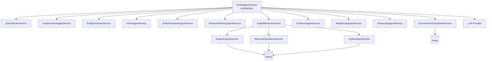
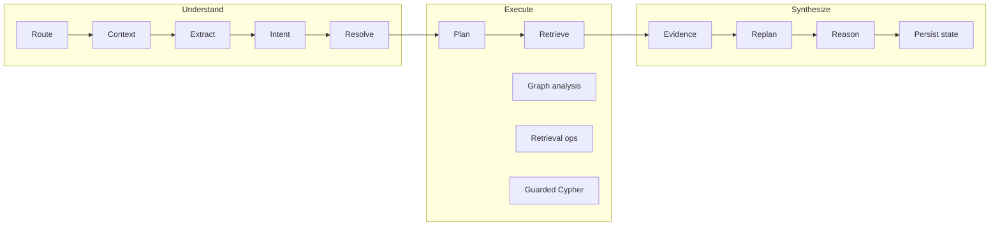

# Agents And Services

This file is the best source for "each agent or layer" slides.

> Presentation note: the first Mermaid diagram is the cleanest service-level picture of the graph-agent stack.

## Graph-Agent Service Map

## Responsibility Layers

## Agent Catalog

| Service | Primary role | Main inputs | Main outputs |
| --- | --- | --- | --- |
| `GraphAgentService` | end-to-end orchestration | query, graph context, session id | text stream, evidence, graph actions, state |
| `QueryRouterService` | classify request shape | query text, graph reference signals | route category, executor preference, gating flags |
| `GraphContextAgentService` | determine active graph subject | selection, visible graph, session state | graph scope, anchors, graph references |
| `EntityExtractionService` | extract explicit mentions and concepts | latest user text | mentions, concepts, operator signals |
| `IntentAgentService` | map request to operational intent | query + route + graph context | intent family, operation, requested types |
| `EntityResolutionAgentService` | resolve mentions against OptimusKG | mentions and concepts | resolved entities, candidates, ambiguity support |
| `RetrievalPlanningAgentService` | convert intent into typed plan steps | route, context, intent, entities, state | `RetrievalPlanStep[]` |
| `GraphRetrieverService` | dispatch plan execution | plan steps + entities | merged evidence, graph deltas, warnings |
| `GraphAnalysisService` | graph-wide analysis executor | graph scope and filters | evidence, graph payloads, highlights |
| `RetrievalOperationsService` | entity-anchored retrieval executor | resolved entities + plan params | evidence, graph payloads, path/network actions |
| `CypherAgentService` | guarded read-only Cypher execution | explicit Cypher requests | rows, evidence, warnings |
| `EvidenceAgentService` | score and package evidence | items, plan, entities, warnings | evidence bundle + confidence assessment |
| `ReplanningAgentService` | add bounded recovery steps | evidence bundle + current plan | appended steps |
| `ReasoningAgentService` | grounded answer synthesis | evidence bundle + graph actions | final narrative response |
| `ConversationGraphStateService` | persist session graph memory | session state and latest results | bounded Redis state |

## Agent Interaction Notes

### `GraphAgentService`

- Central coordinator, not a free-form swarm manager.
- Owns clarification handling, visible-graph mention resolution, bounded replanning, and UI streaming.

### Understanding agents

- `QueryRouterService` decides whether extraction or resolution should run at all.
- `GraphContextAgentService` gives graph context priority over raw text when the user is clearly referring to selected or visible nodes.
- `EntityExtractionService` is constrained to explicit text spans.

### Execution agents

- `RetrievalPlanningAgentService` emits typed steps rather than open-ended tool calls.
- `GraphRetrieverService` fans out only to three executor families:
  - graph analysis
  - retrieval operations
  - guarded Cypher

### Synthesis agents

- `EvidenceAgentService` judges coverage and confidence before final synthesis.
- `ReplanningAgentService` is bounded and targeted.
- `ReasoningAgentService` writes the final grounded response rather than retrieving facts on its own.

## Slide-Ready Layering

- **Orchestrator**: `GraphAgentService`
- **Understanding lane**: router, graph context, extraction, intent, resolution
- **Execution lane**: planner, graph analysis, retrieval operations, guarded Cypher
- **Trust lane**: evidence assessment, bounded replanning, grounded reasoning
- **State lane**: Redis-backed conversation graph state
