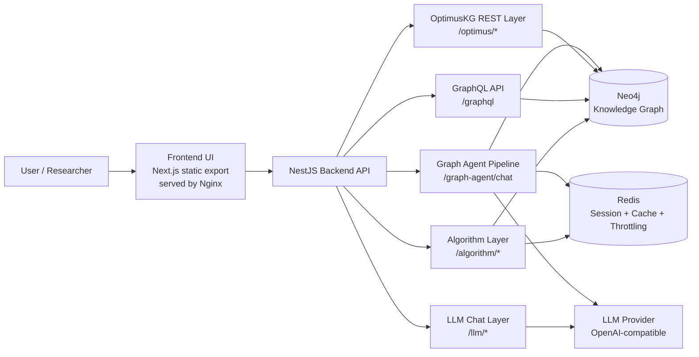
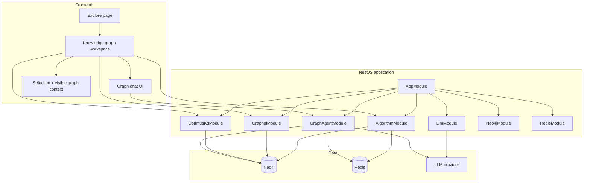

# Current Architecture

This folder now serves two jobs:

1. explain the current implementation accurately
2. give you slide-ready architecture diagrams for presentations

> Presentation note: the two Mermaid blocks in this file are the best "overall architecture" visuals for a PPT.

## System Overview

## Runtime Layers

## What Is Running Today

### Frontend

- Static Next.js export, packaged into an Nginx image for deployment.
- Main exploration entry lives at the explore page and launches the knowledge graph workspace.
- The browser sends graph-aware request context:
  - `selectedNodeContext`
  - `selectedEdgeContext`
  - `networkContext`

### Backend

- Single NestJS service boundary.
- Current major modules:
  - `GraphAgentModule`
  - `OptimusKgModule`
  - `GraphqlModule`
  - `LlmModule`
  - `AlgorithmModule`
  - `Neo4jModule`
  - `RedisModule`

### Data Plane

- Neo4j is the source of truth for graph entities, relationships, and graph traversal.
- Redis stores conversation graph memory, cache-like state, and throttling data.
- LLMs are used for extraction, intent classification, planning support, evidence interpretation, and response synthesis, but not for graph truth.

## Public Backend Surface

| Layer | Route family | Purpose |
| --- | --- | --- |
| OptimusKG | `/optimus/stats`, `/optimus/search`, `/optimus/subgraph`, `/optimus/expand`, `/optimus/path`, `/optimus/nodes/:id` | direct graph exploration and graph payload APIs |
| Graph agent | `/graph-agent/chat` | streamed graph-aware assistant |
| GraphQL | `/graphql` | typed read/query surface |
| LLM | `/llm/*` | general LLM-backed features |
| Algorithm | `/algorithm/*` | graph algorithms and session-linked analysis |

## Why This Architecture Works

- It keeps one backend deployment unit instead of splitting graph logic across many services.
- It separates direct graph APIs from agentic orchestration.
- It treats graph context as a first-class request input instead of reconstructing it from chat history.
- It keeps Neo4j queries and graph actions grounded in the knowledge graph rather than in free-form LLM guesses.

## Slide-Ready Summary

- **Frontend**: graph UI, chat UI, graph-selection context.
- **Backend**: NestJS app with graph APIs plus a specialized graph-agent pipeline.
- **Data**: Neo4j for graph truth, Redis for session/memory, LLM provider for language tasks.
- **Core pattern**: UI context -> route -> plan -> graph-native execution -> grounded response + graph actions.
