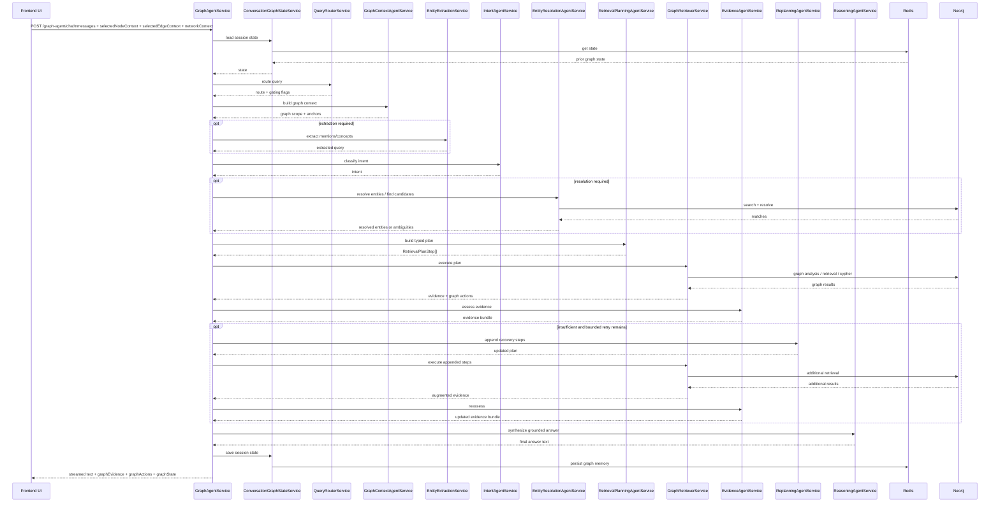
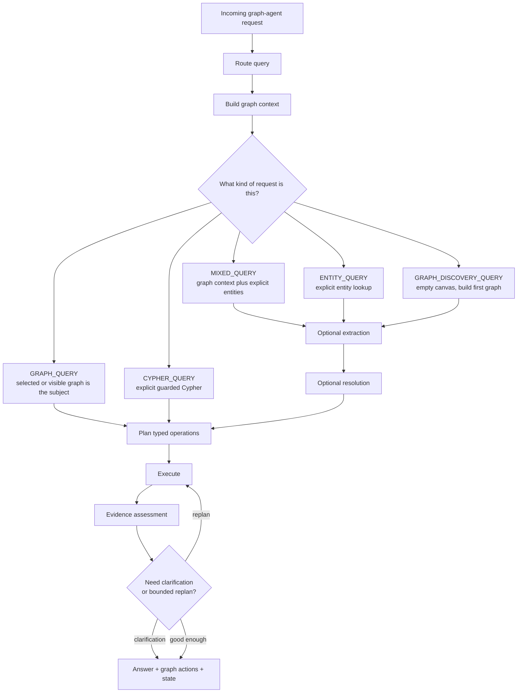

# Execution Flow

> Presentation note: use the sequence diagram for a detailed slide and the branch diagram for a simplified "decision tree" slide.

## End-To-End Sequence

## Request Branching Model

## Context Priority

The planner and executors use this precedence:

1. selected graph
2. visible graph
3. session graph
4. discovery mode

That rule is what makes follow-up questions like "summarize these nodes" or "expand this graph" work without re-specifying all entities.

## Important Runtime Behaviors

### Clarification path

- The system can stop before planning when:
  - the visible graph contains multiple matching nodes for a mention
  - discovery-mode seed resolution is ambiguous
  - the empty-canvas query is too broad to seed safely
- Clarification state is persisted in Redis so the next user turn can resume the original request.

### Discovery path

- If there is no useful current graph, the pipeline can build a compact first network.
- This is a deliberate branch, not an accidental fallback.

### Streamed response contract

The backend streams four UI-facing outputs:

- assistant text
- `graphEvidence`
- `graphActions`
- `graphState`

## Slide-Ready Summary

- **Input**: user question + live graph context.
- **Middle**: route -> context -> extract -> resolve -> plan -> execute.
- **Quality gate**: evidence assessment plus bounded replanning.
- **Output**: grounded answer plus graph updates the UI can apply immediately.
