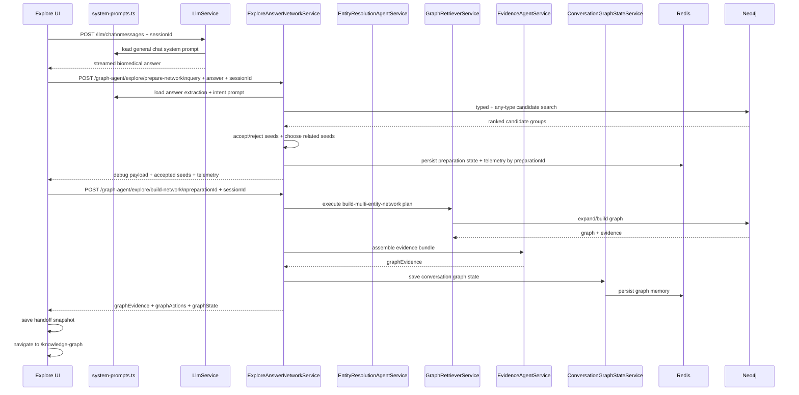
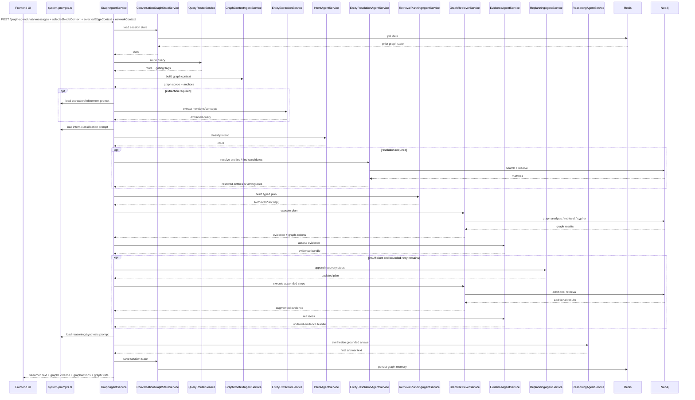

# Execution Flow

> Presentation note: use the sequence diagram for a detailed slide and the branch diagram for a simplified "decision tree" slide.

## End-To-End Sequence

### `/explore` Answer-To-Network Sequence



### `/knowledge-graph` Graph-Agent Sequence



## Request Branching Model

```mermaid
flowchart TD
    S[Incoming request]
    E1[/explore answer request]
    E2[/explore prepare/build request]
    G0[/knowledge-graph graph-agent request]
    A1[Answer immediately via /llm/chat]
    A2[Extract items + infer intent]
    A3[Rank candidates + accept seeds in background]
    A4[User clicks View Network]
    R[Route query]
    C[Build graph context]
    D{What kind of request is this?}

    G1[GRAPH_QUERY\nselected or visible graph is the subject]
    G2[MIXED_QUERY\ngraph context plus explicit entities]
    G3[ENTITY_QUERY\nexplicit entity lookup]
    G4[GRAPH_DISCOVERY_QUERY\nempty canvas, build first graph]
    G5[CYPHER_QUERY\nexplicit guarded Cypher]

    E[Optional extraction]
    X[Optional resolution]
    P[Plan typed operations]
    T[Execute]
    V[Evidence assessment]
    Q{Need clarification\nor bounded replan?}
    A[Answer + graph actions + state]

    S --> E1 --> A1 --> A2 --> A3 --> A4 --> E2 --> P
    S --> G0 --> R --> C --> D
    D --> G1 --> P
    D --> G2 --> E
    D --> G3 --> E
    D --> G4 --> E
    D --> G5 --> P
    E --> X --> P --> T --> V --> Q
    Q -->|clarification| A
    Q -->|replan| T
    Q -->|good enough| A
```

## Context Priority

The planner and executors use this precedence:

1. selected graph
2. visible graph
3. session graph
4. discovery mode

That rule is what makes follow-up questions like "summarize these nodes" or "expand this graph" work without re-specifying all entities.

## Important Runtime Behaviors

### Clarification path

- The system can stop before planning when:
  - the visible graph contains multiple matching nodes for a mention
  - discovery-mode seed resolution is ambiguous
  - the empty-canvas query is too broad to seed safely
- Clarification state is persisted in Redis so the next user turn can resume the original request.

### Discovery path

- If there is no useful current graph, the pipeline can build a compact first network.
- This is a deliberate branch, not an accidental fallback.

### `/explore` preparation path

- The initial `/explore` answer does not wait for graph generation.
- Entity extraction, concept detection, intent inference, and candidate lookup start only after the answer text is complete.
- Graph construction happens only when the user clicks `View Network`.
- The resulting graph state is saved before navigation so `/knowledge-graph` follow-up questions continue from the prepared network.
- The `/explore` chat shows a collapsible debug panel with extracted items, candidate groups, accepted seeds, rejected items, and build telemetry.

### Prompt loading

- Backend system prompts are centralized in `backend/src/llm/system-prompts.ts`.
- `/llm/chat` and `/llm/kg-chat` load their own dedicated system prompts from that registry.
- The graph-agent path loads stage-specific prompts for clarification, extraction refinement, decomposition, intent classification, reasoning, and response synthesis.
- The `/explore` preparation path uses a separate extraction + intent system prompt so answer parsing and graph-expansion preferences are tuned independently from user-query extraction.

### Streamed response contract

The graph-agent backend streams four UI-facing outputs:

- assistant text
- `graphEvidence`
- `graphActions`
- `graphState`

## Slide-Ready Summary

- **`/explore`**: answer first, then extract items, infer intent, rank candidates, and prepare accepted graph seeds in the background.
- **`/knowledge-graph`**: route -> context -> extract -> resolve -> plan -> execute.
- **Quality gate**: evidence assessment plus bounded replanning inside the graph-agent path.
- **Output**: optional graph handoff from `/explore`, then grounded graph-native continuation in `/knowledge-graph`.
