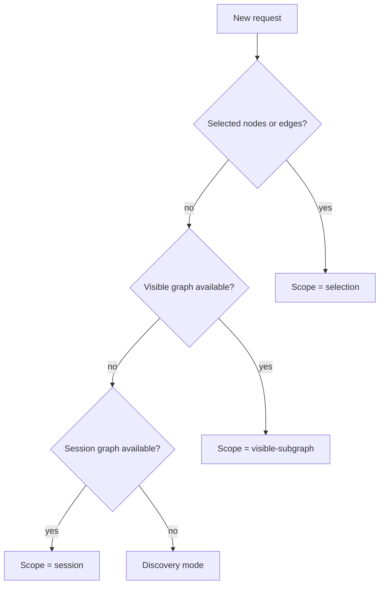
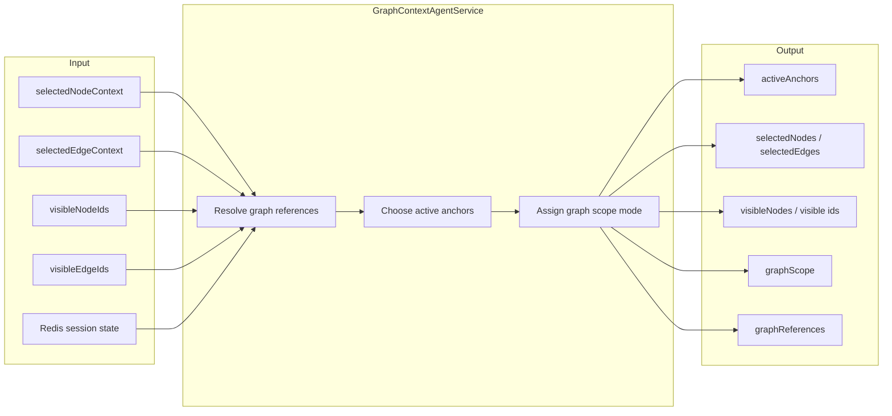

# Graph Context Model

This file explains how the backend decides what graph the user is talking about.

> Presentation note: the precedence diagram below is the cleanest "graph context" visual for a slide.

## Context Precedence

## Current Input Contract

The frontend can send:

- `selectedNodeContext`
- `selectedEdgeContext`
- `networkContext.totalNodes`
- `networkContext.totalEdges`
- `networkContext.selectedNodeIds`
- `networkContext.selectedEdgeIds`
- `networkContext.visibleNodeIds`
- `networkContext.visibleEdgeIds`
- `networkContext.visibleNodeContext`
- `networkContext.topNodeTypes`

## Source Types

### 1. Selected graph

Used when the request refers to:

- "these nodes"
- "selected nodes"
- "this edge"
- "compare these"
- "how are these connected"

This is the strongest signal because it is the most explicit graph subject.

### 2. Visible graph

Used when nothing is selected but the user clearly means the graph currently on screen:

- "summarize this graph"
- "what does this network show"
- "what relationships dominate here"

### 3. Session graph

Used when the live frontend context is sparse but the conversation already established graph anchors in a prior turn.

### 4. Discovery mode

Used when:

- nothing is selected
- the visible graph is effectively empty
- session graph fallback is not sufficient
- the user wants the system to create the first useful graph

## Graph Scope Model

## Current Output Shape

The context agent returns:

- `activeAnchors`
- `selectedNodes`
- `selectedEdges`
- `visibleNodes`
- `visibleNodeIds`
- `visibleEdgeIds`
- `graphScope`
- `graphReferences`
- `selectedNodeTypes`
- `selectedEdgeTypes`

## Planner Rules

- Selected graph beats visible graph.
- Visible graph beats session graph.
- Session graph beats discovery mode.
- Graph-subject questions do not need forced entity resolution when the graph itself is already the subject.
- Mixed questions combine graph anchors with newly resolved entities.

## Why This Matters

Without explicit graph context handling, the agent would incorrectly treat many graph-subject questions as generic chat prompts and try to rediscover already-selected nodes from text. The current model avoids that failure mode.

## Slide-Ready Summary

- **Selection** is strongest.
- **Visible graph** is second.
- **Session memory** is fallback continuity.
- **Discovery mode** is only for empty-canvas requests that need the first graph to be built.
