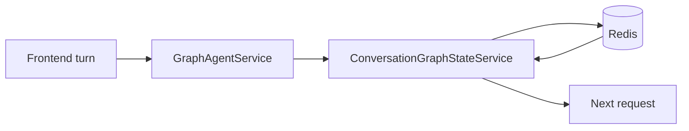
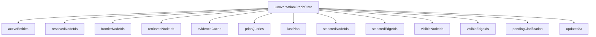
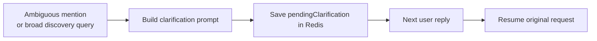

# Memory Model

The system uses memory to preserve graph continuity, not to simulate open-ended long-form chat memory.

> Presentation note: the state-shape diagram below works well as a Redis/session-memory slide.

## Memory Placement

## State Shape

## Current Stored Fields

| Field | Purpose |
| --- | --- |
| `sessionId` | conversation/session key |
| `activeEntities` | working set of resolved anchors |
| `resolvedNodeIds` | accumulated entity node ids |
| `frontierNodeIds` | useful expansion candidates for follow-up turns |
| `retrievedNodeIds` | nodes already covered by retrieval |
| `evidenceCache` | recent evidence items for continuity and avoidance of redundant weak retrieval |
| `priorQueries` | recent question history |
| `lastPlan` | most recent typed execution plan |
| `selectedNodeIds` | last selected graph nodes |
| `selectedEdgeIds` | last selected graph edges |
| `visibleNodeIds` | last visible graph nodes |
| `visibleEdgeIds` | last visible graph edges |
| `pendingClarification` | unresolved ambiguity state |
| `updatedAt` | latest write timestamp |

## Pending Clarification State

One of the newer behaviors in the live code is persisted clarification state.

`pendingClarification` stores:

- clarification kind
- original query
- pending intent and operation
- extracted query snapshot
- already resolved entities
- unresolved entity text
- candidate entity list

## How Memory Is Used

### Graph continuity

- Follow-up requests can reuse active graph anchors even when the user does not restate them.

### Planning continuity

- The planner can consider previous successful anchors and graph frontier nodes.

### Clarification continuity

- Ambiguity resolution can span multiple turns without losing the original request.

### Evidence continuity

- Recent evidence helps avoid repeating low-value retrieval and supports better follow-up reasoning.

## Bounding Rules

The stored state is intentionally bounded:

- arrays are deduplicated
- evidence is capped
- node-id sets are trimmed
- active entities are ranked and merged instead of growing unbounded

## Design Principle

This is **graph memory**, not generic memory. It exists to preserve:

- graph subject
- graph anchors
- execution continuity
- clarification continuity
- recent evidence

It does not exist to treat the system like an unconstrained chat diary.

## Slide-Ready Summary

- Redis stores session-scoped graph memory.
- Memory keeps graph continuity across turns.
- The most important recent addition is `pendingClarification`, which lets the system safely pause and resume ambiguous requests.
