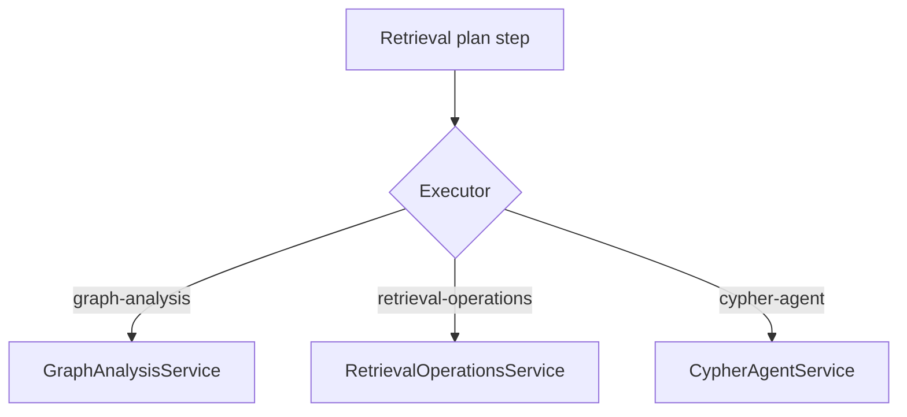
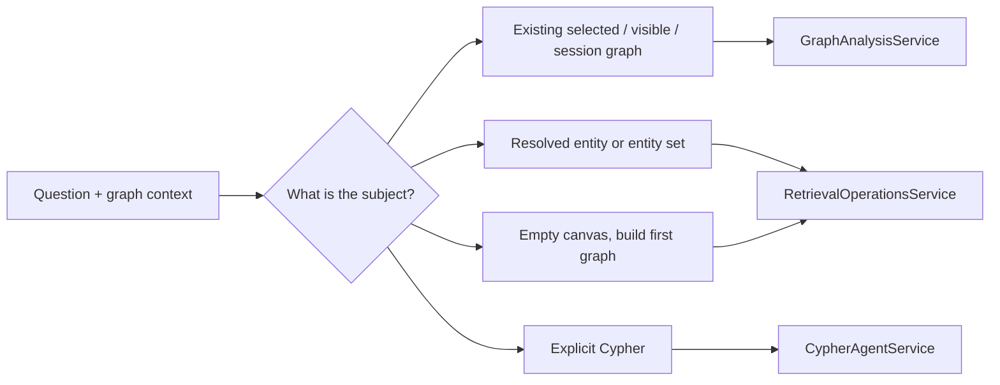

# Retrieval Operations

This file explains how execution is divided after planning.

> Presentation note: use the first diagram to explain the executor split, then use the grouped operation sections as backup slides.

## Executor Split

## Operation Selection Model

## Graph Analysis Family

Owned by `GraphAnalysisService`. This family is used when the graph itself is the subject.

### Summary and interpretation

- summarize selected nodes
- summarize visible subgraph
- interpret subgraph
- identify graph theme
- identify central concepts
- summarize biological narrative

### Schema and relationship inspection

- analyze schema
- analyze node types
- analyze relationship types
- find available node types
- find available relationship types
- rank dominant relationships
- analyze cross-type connections

### Topology and network metrics

- compute graph metrics
- compute node-type distribution
- compute relationship distribution
- compute centrality metrics
- compute density metrics
- compute component statistics
- find hub nodes
- find bridging nodes

### Community and module analysis

- detect communities
- detect disease modules
- detect functional modules
- detect gene modules

### Ontology and enrichment

- find parents, children, ancestors, descendants
- explore ontology hierarchy
- enrich diseases, pathways, phenotypes, anatomy, and ontology categories

## Retrieval Operations Family

Owned by `RetrievalOperationsService`. This family is used when entities or explicit traversals are the subject.

### Core retrieval

- load node details
- retrieve relationship evidence
- find shortest path
- traverse typed paths
- retrieve neighborhood
- expand network

### Discovery network builders

- discover graph
- build disease network
- build gene network
- build drug network
- build pathway network
- build relationship network
- build multi-entity network

### Typed biomedical retrieval

- related diseases, genes, proteins, pathways, drugs
- drug indications, targets, contraindications, mechanisms, off-label uses
- disease genes and phenotypes
- gene diseases and pathways
- pathway genes and diseases
- anatomy-linked and exposure-linked entities
- clinical guidelines

### Ambiguity support

- find candidate entities
- find visible-graph matches
- rank entity candidates

## Guarded Cypher Family

Owned by `CypherAgentService`.

- only used for explicit Cypher-style requests
- read-only by design
- not the default retrieval path

## Planning Heuristics

- Use graph analysis when the user is asking about the current graph as a whole.
- Use retrieval operations when the user is asking about explicit entities or entity-to-entity relations.
- Use discovery builders when the canvas is empty and the system must generate the first useful graph.
- Use Cypher only when the user intentionally asks for Cypher.

## Why This Split Matters

Older graph agents often overused one generic "neighborhood" tool. The current architecture is more deliberate:

- graph-wide questions stay graph-wide
- entity lookups stay entity-centered
- discovery is first-class
- Cypher is constrained

## Slide-Ready Summary

- **GraphAnalysisService** answers "what does this graph mean?"
- **RetrievalOperationsService** answers "what is connected to this entity?"
- **CypherAgentService** answers "run this safe read-only Cypher"
