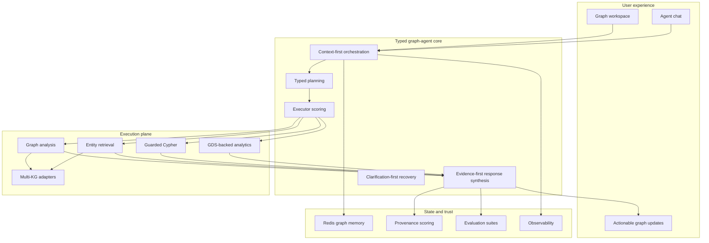

# Target Architecture

This file describes where the project should evolve next without changing its core shape.

> Presentation note: this is the roadmap slide deck source. The first diagram is the best "target state" visual.

## Target Shape

## What Should Stay Stable

- one backend service boundary
- one orchestrator
- typed plan steps
- graph-context-first execution
- Neo4j-backed truth model
- bounded replanning
- guarded Cypher boundary

## What Should Improve Next

### 1. Stronger analytics

- GDS-backed community detection
- better centrality and module scoring
- more statistically meaningful enrichment

### 2. Better planning quality

- stronger executor selection
- richer multi-step plan composition
- better plan verification against real graph scope

### 3. Better ambiguity handling

- clarification as a more explicit planner output
- richer candidate grouping
- better visible-graph disambiguation

### 4. Better trust and evaluation

- stronger provenance-aware evidence scoring
- targeted eval suites for:
  - graph summary
  - ontology traversal
  - discovery flows
  - drug/pathway search

### 5. Better extensibility

- keep OptimusKG as the current primary source
- make execution contracts reusable for additional KGs later

## Current vs Target

| Dimension | Current | Target |
| --- | --- | --- |
| Orchestration | typed single orchestrator | same, but with stronger verification |
| Analytics | Neo4j traversal + custom logic | richer graph analytics, optionally GDS-backed |
| Clarification | handled inside orchestrator | promoted to a more explicit plan/recovery capability |
| Evidence | bundled and scored | more provenance-aware, more evaluable |
| Data sources | OptimusKG-centered | OptimusKG-first, adapter-friendly |

## Explicit Non-Goals

Avoid drifting into:

- free-form multi-agent debate loops
- unconstrained generated Cypher as the default path
- LLM-only entity existence checks
- fragmented microservices without a clear benefit

## Slide-Ready Summary

- Keep the architecture **typed**, **graph-native**, and **single-service**.
- Improve analytics, planning quality, clarification, and evaluation.
- Grow toward a stronger platform, not a looser swarm.
