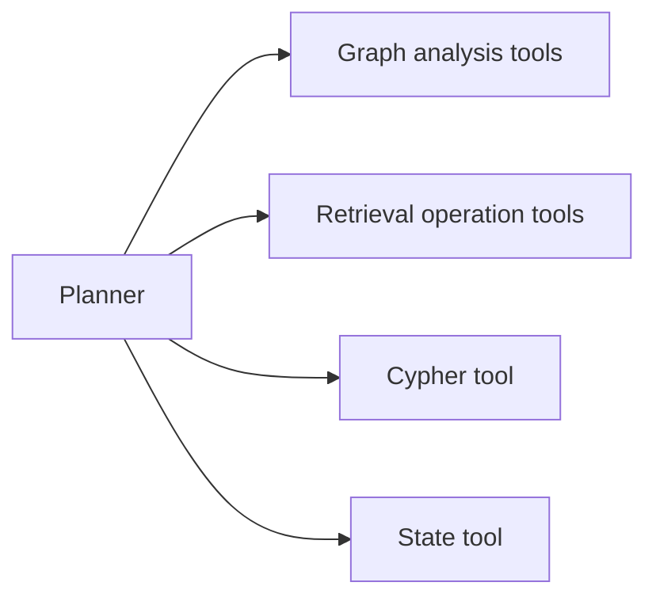
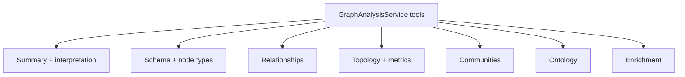
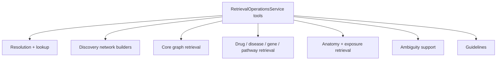

# Tool Surface

This file explains the tool vocabulary that the planner emits through `RetrievalPlanStep.tool`.

> Presentation note: the executor-to-tool map below works well as a "tooling architecture" slide.

## Tool Surface Map

## Tool Families

### Graph analysis tools

Used when the graph itself is the subject.

Representative tools:

- `summarizeNodes`
- `summarizeSubgraph`
- `interpretSubgraph`
- `identifyGraphTheme`
- `analyzeSchema`
- `analyzeNodeTypes`
- `analyzeRelationshipTypes`
- `findCrossTypeRelationships`
- `computeGraphMetrics`
- `computeCentralityMetrics`
- `detectCommunities`
- `findAncestors`
- `exploreOntologyHierarchy`
- `enrichDiseases`
- `enrichPathways`

### Retrieval operation tools

Used when the subject is an entity, an entity set, or an empty-canvas discovery task.

Representative tools:

- `searchEntities`
- `resolveEntity`
- `getNodeDetails`
- `discoverGraph`
- `buildDiseaseNetwork`
- `buildGeneNetwork`
- `buildDrugNetwork`
- `buildMultiEntityNetwork`
- `retrieveSubgraph`
- `expandSubgraph`
- `shortestPath`
- `getRelatedEntities`
- `getDrugTargets`
- `getDiseaseGenes`
- `getGenePathways`
- `getPathwayGenes`
- `getExposureDiseases`
- `findCandidateEntities`
- `findVisibleGraphMatches`
- `retrieveClinicalGuidelines`

### Guarded Cypher tool

- `executeGuardedCypher`

Used only for explicit, read-only Cypher requests.

### State tool

- `getConversationGraphState`

Used when the system needs a state-oriented answer such as network summary behavior.

## Tool Selection Rules

- Prefer graph-analysis tools for selected, visible, or session graph analysis.
- Prefer retrieval-operation tools for resolved-entity traversal and discovery graph construction.
- Prefer the Cypher tool only for explicit Cypher requests.
- Avoid using entity-resolution tools for graph-subject questions unless explicit new entities must be resolved.

## Tooling Design Pattern

The planner does **not** emit arbitrary code or arbitrary database queries. It emits a constrained tool choice from a known vocabulary. That gives the architecture:

- predictability
- inspectability
- safer execution
- easier debugging
- clearer evaluation

## Slide-Ready Summary

- Planner output is a typed tool call, not a free-form instruction.
- Tools are grouped by executor family.
- This keeps the system auditable and presentation-friendly.
